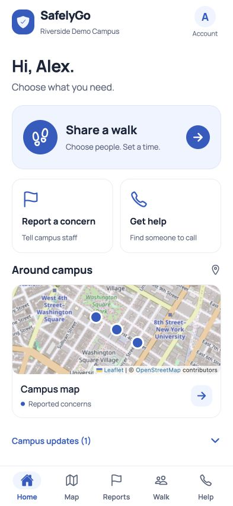
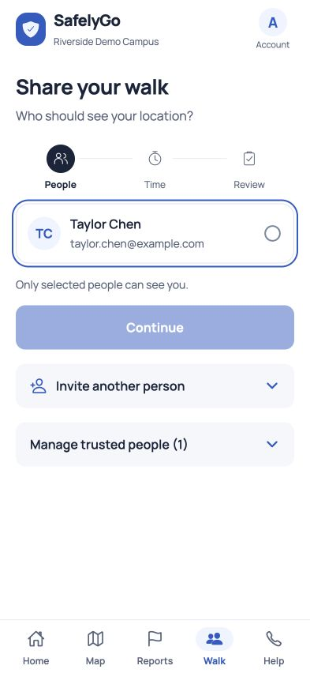
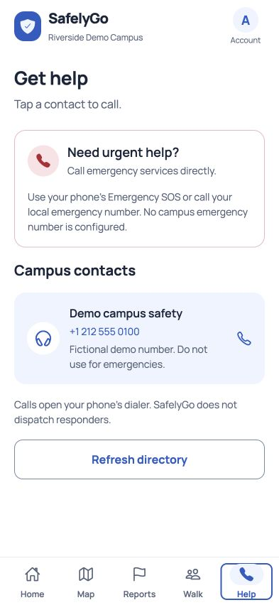

<div align="center">
  
  <h1>SafelyGo</h1>
  <p>Campus safety, trusted contacts, and a clearer way home.</p>
  <p><a href="https://github.com/d1tokirb/BPAV05-SafelyGo/actions/workflows/check.yml"></a></p>
  <p>React Native · Expo · TypeScript · PostgreSQL · Railway</p>
</div>

SafelyGo brings reports, campus resources, and time-limited location sharing into one mobile app. Each campus has its own membership, staff tools, and operator approval process. Students use their regular email address and a campus invitation code.

<table>
<tr><td></td><td></td><td></td></tr>
</table>

*Browser previews with fictional demo data. Native appearance and background behavior require device testing.*

## What it does

- **Campus map and reports:** submit a concern, follow its status, and view staff-published summaries.
- **Walk sharing:** invite trusted contacts, choose recipients, and share your latest position for 15–120 minutes.
- **Campus help:** find campus numbers and confirm before calling.
- **Campus administration:** review reports, manage announcements, contacts and members, and approve campus applications.
- **Account controls:** verification, recovery, profile editing, privacy information and account deletion.

Location sharing is explicit and expires. Private report details stay with the author and authorized staff. Account deletion removes account access and sharing records; retained reports have their author reference removed.

## Project structure

| Directory | Purpose |
| --- | --- |
| `mobile/` | Expo SDK 57 app for iOS and Android, plus web preview |
| `server/` | Express API, PostgreSQL migrations, email outbox and tests |
| `docs/` | Deployment, architecture, testing and BPA documentation |
| `scripts/` | Deployment check and submission tooling |

## Run locally

Use Node.js 24 and PostgreSQL. From the repository root:

```sh
npm ci --prefix server
npm ci --prefix mobile
cp server/.env.example server/.env
cp mobile/.env.example mobile/.env
```

Set `DATABASE_URL` in `server/.env` to your local PostgreSQL database. Optional Docker users can run `docker compose up -d` and use the connection in `compose.yaml`; Docker is not required.

Start the API and Expo in separate terminals:

```sh
npm run dev:api
npm start
```

For a phone, set `EXPO_PUBLIC_API_URL` in `mobile/.env` to an API address reachable from that phone. `localhost` on a phone refers to the phone itself. Deployed builds use your HTTPS Railway API URL.

Development emails are written to `server/.mail/` with `MAIL_MODE=file`. Those files and all private environment files are excluded from Git.

## Deploy from GitHub to Railway

1. Connect this GitHub repository to a Railway API service.
2. Set **Root Directory** to `server` and **Railway Config File** to `/server/railway.json`.
3. Add Railway PostgreSQL and reference its `DATABASE_URL` in the API service.
4. Configure the production variables in [Release handoff](docs/RELEASE_HANDOFF.md).
5. Generate the API's HTTPS domain, then set it as the Expo production `EXPO_PUBLIC_API_URL` before building the mobile app.

Railpack builds the Node.js service automatically. Migrations run before the API accepts requests, and `/health` checks its database connection. Resend HTTPS email delivery supports Railway's Free/Hobby networking restrictions. The optional Dockerfile is an alternative build path, not the default deployment.

## Verification

```sh
npm run check
npm --prefix mobile run lint
npm run build:api
# Requires an existing disposable test database; the suite clears it.
TEST_DATABASE_URL=postgresql://localhost/safelygo_test npm run release:check
```

The release check runs type checks, lint, service journeys and all-platform exports. CI uses its own PostgreSQL test service. To check a deployed API without creating accounts or sending emails:

```sh
npm run deployment:check -- https://YOUR-API-DOMAIN
```

Optional fictional demo data can be seeded locally with `DEMO_SEED=true DEMO_PASSWORD='your-local-password-at-least-12-characters' npm --prefix server run seed` after setting the environment. Never seed production.

## Release status

The app and API are implemented and locally tested. Live release still requires Railway provisioning, a verified email sender, actual operator/support details, store declarations, signing, and physical-device acceptance. Outstanding upstream build-tooling advisories are recorded in the [release handoff](docs/RELEASE_HANDOFF.md); this repository does not claim a clean mobile dependency audit.

SafelyGo is not emergency dispatch. Background location depends on device permissions and OS restrictions. Use local emergency services for immediate danger.

## Documentation

- [Deployment and release handoff](docs/RELEASE_HANDOFF.md)
- [Campus operations](docs/CAMPUS_OPERATIONS.md)
- [Architecture](docs/ARCHITECTURE.md) and [API reference](docs/API.md)
- [Testing](docs/TESTING.md) and [journey acceptance](docs/JOURNEY_ACCEPTANCE.md)
- [BPA requirements](docs/REQUIREMENTS.md), [AI assistance record](docs/AI_USAGE.md) and [sources](docs/SOURCES.md)
- [Security reporting](SECURITY.md)

BPA release and AI documentation forms require human completion. No signed forms, live service, or store approval are implied. Source-package and draft-submission scripts write ignored artifacts to `output/`.

## License

No project-wide reuse license has been granted. Third-party code and assets retain their respective notices, including the Expo template notice in `mobile/LICENSE`.
