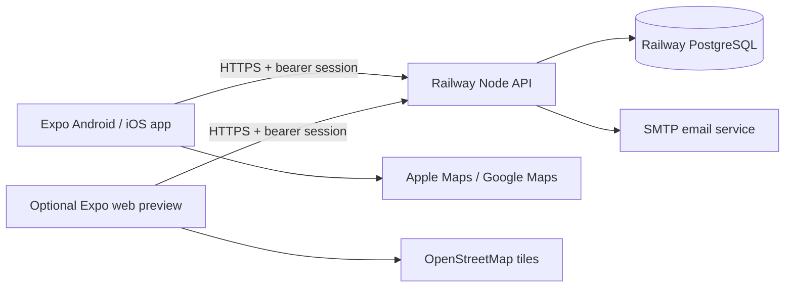

# Architecture

## Layers and design patterns

ApiClient is a typed object-oriented service boundary. Screens call this service rather than using database credentials. Shared primitives handle fields, actions, notices and map rendering. React state/context separates account identity from campus selection. Hooks manage async loading and polling.

The API uses Express middleware for authentication, verification and campus membership; explicit role guards protect staff/owner mutations. Transaction helpers group changes that must commit together. PostgreSQL migrations are versioned and locked so parallel deploys cannot race. A durable outbox couples auth-code creation and email scheduling in the same transaction. Platform-specific map components keep native code out of the web bundle. Expo TaskManager defines the background task at module scope.

## Data relationships

Users have many memberships; every membership references one campus and a student/staff/owner role. Reports, emergency directory entries, announcements and audit records reference a campus. Trusted contacts are between two verified users; only the recipient accepts an invitation. Sharing sessions reference an owner and separately authorized recipients. They are independent of campus staff authority.

## Security and privacy

- Passwords use salted scrypt hashes. Raw opaque session tokens are stored in native SecureStore; the server stores SHA-256 token hashes. Web previews keep tokens in sessionStorage rather than persistent localStorage.
- Account codes expire after 15 minutes, permit at most five attempts, and are single-use. New codes replace old codes for the same purpose. Reset revokes sessions and sharing; verification is required for campus/contact access.
- SQL is parameterized. Tenant-owned reads and writes include the authorized campus ID. A user-supplied target ID cannot bypass campus or role checks.
- Report details remain private to author/staff. Other members see only a staff-authored public summary, category, severity, map position and status; author identity and internal notes are omitted.
- Location sharing requires an accepted contact, explicit recipient selection, limited duration and current session authorization. Stop/delete/expiry revokes reads; removing a contact deletes relevant recipient grants. Latest location only; no route history.
- Platform review gates campus activation. Institutional domain and invitation code gate student joining. Owners alone delegate staff; owners cannot demote/delete themselves through member administration.
- PostgreSQL rate-limit counters are shared across replicas. Helmet sets HTTP security headers; body sizes and schemas are limited; CORS permits configured web origins.
- No production demo accounts, plaintext password logs, or mobile database secrets.

## Reliability and limitations

Map/report/sharing reads poll every 10 seconds while the relevant screen is mounted. The API is the source of truth for expiry and permissions. Mobile location updates are best effort and positions display freshness/accuracy. Background tracking depends on OS delivery and signed native builds. No push notification, SMS dispatch, automated threat detection or route-safety guarantee is claimed. Announcements are in-app.

Reports, campus discovery, members and audit histories use bounded pages with previous/next controls. Maps show the currently selected report page. No offline report queue: a failed submission preserves entered form data and shows an error so the student can retry. Network/provider readiness and signed builds remain deployment work.

## Navigation, drafts and operator review

Expo Router owns screen URLs and Back navigation. Shared identity/campus context wraps the route outlet. Report, walk setup, campus registration and staff forms restore per-account drafts before editing. Web drafts use tab-scoped session storage; native drafts use encrypted SecureStore chunks with serialized writes and an atomic manifest. Account deletion purges that user's registered device drafts. Drafts preserve form input, not an offline submission queue.

Email invitations can precede registration. Once verified, the intended recipient can claim and accept the request without joining a campus. Platform review has an authenticated allowlist-based app interface alongside the trusted operator CLI. Owners can hand over to verified campus staff in Settings; approval and owner handover commit audit and email-outbox entries with the access change.

Campus search has no default public geocoding endpoint. Deployments must supply a permitted provider or self-hosted compatible endpoint. Manual map selection remains available when search is disabled.

Map proximity groups preserve the original records and update with zoom. Group details read the latest visible data rather than caching a popup snapshot. Report history shows actual submitted/updated timestamps, without inventing intermediate transitions. Expo Go is explicitly excluded from background location capability; failed starts attempt remote revocation and local tracking cleanup independently.
